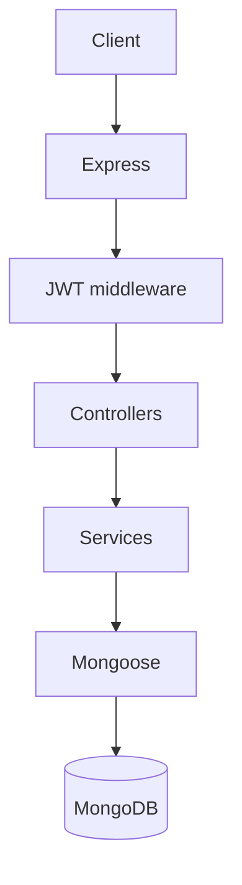

# AlgoForge Backend

REST API for **AlgoForge**: track preparation **journeys**, **learning items** (problems/topics), and **submissions** (attempts). Stack: **Node.js**, **Express 5**, **MongoDB**, **Mongoose**, **JWT** + **bcrypt**.

This README is the **full backend reference** for developers and frontend integration.

---

## Table of contents

1. [Quick start](#1-quick-start)  
2. [Repository layout](#2-repository-layout)  
3. [Architecture](#3-architecture)  
4. [Environment](#4-environment)  
5. [Data model & MongoDB](#5-data-model--mongodb)  
6. [Indexes](#6-indexes)  
7. [Authentication & security](#7-authentication--security)  
8. [HTTP API reference](#8-http-api-reference)  
9. [Business rules](#9-business-rules)  
10. [Dashboard (`GET /api/dashboard`)](#10-dashboard-get-apidashboard)  
11. [Errors](#11-errors)  
12. [Performance & scalability](#12-performance--scalability)  
13. [Known limitations & improvements](#13-known-limitations--improvements)  
14. [Endpoint cheat sheet](#14-endpoint-cheat-sheet)

---

## 1. Quick start

```bash
cp .env.example .env   # set MONGODB_URI (or MONGO_URI), JWT_SECRET
npm install
npm run dev            # nodemon src/server.js
# or: npm start        # node src/server.js
```

Default port: **3000** (override with `PORT`).

---

## 2. Repository layout

| Path | Purpose |
|------|--------|
| `src/server.js` | `dotenv`, Mongoose connect, `listen` |
| `src/app.js` | Express: CORS, JSON 1MB, routes, 404, error handler |
| `src/config/env.js` | Validates `JWT_SECRET`, Mongo URI |
| `src/middleware/auth.js` | JWT `Bearer` → `req.userId` |
| `src/middleware/errorHandler.js` | Validation, duplicate key, CastError, statusCode |
| `src/models/` | User, Journey, LearningItem, Submission |
| `src/routes/` | auth, journeys (+ nested items/submissions), dashboard |
| `src/controllers/` | Thin HTTP layer |
| `src/services/` | Ownership, cascades, dashboard aggregations |
| `src/utils/` | jwt, password, asyncHandler |

---

## 3. Architecture



- **Public:** `GET /api/health`, `POST /api/auth/register`, `POST /api/auth/login`  
- **Protected:** everything else uses `Authorization: Bearer <token>` (`sub` = user ObjectId string).

---

## 4. Environment

| Variable | Required | Default |
|----------|----------|--------|
| `MONGODB_URI` or `MONGO_URI` / `MONGO_URL` | Yes | — |
| `JWT_SECRET` | Yes | — |
| `PORT` | No | `3000` |
| `JWT_EXPIRES_IN` | No | `7d` |
| `NODE_ENV` | No | `development` |

---

## 5. Data model & MongoDB

MongoDB collection names (Mongoose defaults): **`users`**, **`journeys`**, **`learningitems`**, **`submissions`**.

### User

- **Auth:** `username`, `email` (unique), `passwordHash` (bcrypt, not selected by default)  
- **Profile (UI):** `photo`, `organisation`, `number`, `resume`, `address`, `city`, `state`, `country`, `education[]`, `workExperience[]`, `skills[]`, `currentCompany`  
- **Note:** Username is **not** unique (only email).

### Journey

- **Refs:** `userId`  
- **Content:** `title`, `description`, `category`, `journeyType`, `targetItems`, `startDate`, `endDate`  
- **Workflow:** `status`, `visibility`, `priority`, `lastActivityAt`, `metadata`  
- **Timestamps:** `createdAt`, `updatedAt`

**Enums:**  
`status`: `planned` | `active` | `paused` | `completed` | `archived`  
`journeyType`: `DSA` | `SYSTEM_DESIGN` | `DBMS` | `OS` | `WEB_DEV` | `CUSTOM`  
`visibility`: `private` | `unlisted` | `public`

### LearningItem

- **Refs:** `userId`, `journeyId`  
- **Content:** `title`, `description`, `type`, `status`, `orderIndex`, platform fields, `tags`, `notes`, `resources[]`, `flags`  
- **Counters:** `submissionCount`, `lastSubmissionAt` (maintained on submission create/delete)  
- **Revision:** `revisionRequired`, `revisionCount`, `lastReviewedAt`

**Enums:**  
`type`: `problem` | `topic` | `reading` | `video` | `task` | `other`  
`status`: `pending` | `in_progress` | `completed` | `skipped`

### Submission

- **Refs:** `userId`, `journeyId`, `itemId`  
- **Core:** `attemptNumber`, `solvingMethod`, `language`, `code`, complexities, `notes`, `createdAt`  
- **Extended:** `languageVersion`, `title`, `tags`, `resultStatus`, score/runtime/memory/tests, `isStarred`, `externalUrl`, reviewer fields, `metadata`

**Enums:**  
`solvingMethod`: `self` | `hint` | `partial_help` | `full_solution` | `failed`  
`resultStatus`: `unspecified` | `accepted` | `wrong_answer` | `time_limit` | `runtime_error` | `partial`

---

## 6. Indexes

Declared in schemas (and used by aggregations / lookups):

| Collection | Indexes (summary) |
|------------|---------------------|
| **users** | `username`; unique on `email` |
| **journeys** | `userId`; `userId + createdAt`; `userId + status`; `userId + status + lastActivityAt` |
| **learningitems** | `userId`; `journeyId`; `journeyId + createdAt`; `journeyId + orderIndex`; `userId + journeyId`; `userId + tags`; `userId + journeyId + status` |
| **submissions** | `userId`; `itemId + createdAt`; `userId + journeyId + itemId`; `userId + isStarred`; **`userId + createdAt`**; **`userId + itemId + attemptNumber`** |

New indexes apply to **new** writes; existing deployments may run `syncIndexes()` or rely on Mongoose createIndexes on connect.

---

## 7. Authentication & security

| Topic | Behavior |
|-------|----------|
| **Register** | `POST /api/auth/register` — password min length **8**, bcrypt hash stored |
| **Login** | `POST /api/auth/login` — returns JWT; payload `{ sub: userId }` |
| **Protected routes** | Missing/invalid token → **401** |
| **Ownership** | All journey/item/submission queries scoped by `userId` from JWT |

**Gaps (production hardening):**

- No **rate limiting** on login/register (brute force risk).  
- No **refresh tokens** / revoke list.  
- CORS is **open** — restrict `origin` in production.  
- Consider **Helmet** and stricter JSON/body limits for public APIs.

**Edge case:** Invalid or non-ObjectId `sub` in JWT can cause **CastError** in some code paths → may surface as **500**; treat as bad token and re-login.

---

## 8. HTTP API reference

Base URL: `/api`.  
JSON body max: **~1MB** (large code in submissions).

### 8.1 Health

| Method | Path | Auth |
|--------|------|------|
| GET | `/api/health` | No |

**200:** `{ "ok": true }`

### 8.2 Auth

| Method | Path | Auth | Body |
|--------|------|------|------|
| POST | `/api/auth/register` | No | `{ username, email, password }` |
| POST | `/api/auth/login` | No | `{ email, password }` |
| GET | `/api/auth/me` | Yes | — |
| GET | `/api/auth/user-details` | Yes | — (alias of `/me`) |

**Register/Login 200/201:** `{ token, user }` where `user` has `id`, `username`, `email`, `createdAt`.

**GET /me:** Full profile object (no `passwordHash`) — see previous README section for field list.  
**Note:** There is no **PATCH** profile endpoint yet.

### 8.3 Dashboard

| Method | Path | Auth |
|--------|------|------|
| GET | `/api/dashboard` | Yes |

See [§10 Dashboard](#10-dashboard-get-apidashboard).

### 8.4 Journeys

| Method | Path | Auth |
|--------|------|------|
| GET | `/api/journeys` | Yes |
| POST | `/api/journeys` | Yes |
| GET | `/api/journeys/:journeyId` | Yes |
| PATCH | `/api/journeys/:journeyId` | Yes |
| DELETE | `/api/journeys/:journeyId` | Yes |

**POST body:** required `title`; optional fields per **Journey** model (§5).

**DELETE:** Cascades all **items** in that journey and all their **submissions**.

### 8.5 Learning items

Prefix: `/api/journeys/:journeyId/items`

| Method | Path | Auth |
|--------|------|------|
| GET | `/` | Yes |
| POST | `/` | Yes |
| GET | `/:itemId` | Yes |
| PATCH | `/:itemId` | Yes |
| DELETE | `/:itemId` | Yes |

**POST:** required `title`. List sorted by `orderIndex`, then `createdAt` desc.

**DELETE:** Cascades **submissions** for that item.

### 8.6 Submissions

Prefix: `/api/journeys/:journeyId/items/:itemId/submissions`

| Method | Path | Auth |
|--------|------|------|
| GET | `/` | Yes |
| POST | `/` | Yes |
| GET | `/:submissionId` | Yes |
| PATCH | `/:submissionId` | Yes |
| DELETE | `/:submissionId` | Yes |

**POST:** required `solvingMethod`, `language`. Optional `attemptNumber` (auto-increment if omitted).

**DELETE:** Recalculates item `submissionCount` and `lastSubmissionAt`.

---

## 9. Business rules

| Rule | Detail |
|------|--------|
| **Nesting** | Journey → Items → Submissions; URLs mirror this. |
| **Ownership** | Every document carries `userId`; updates/deletes require match. |
| **Cascade** | Delete journey → delete items → delete submissions. Delete item → delete submissions. |
| **lastActivityAt** | Updated on item/submission create/update/delete (journey touch). |
| **submissionCount** | Increment on submission create; full recount after submission delete. |
| **IDs** | Route params must be valid **24-char hex** ObjectIds or API returns **400** (CastError). |

---

## 10. Dashboard (`GET /api/dashboard`)

Single response for the logged-in user. Built from **aggregations** + counts.

### Active journey

- First journey with `status: "active"`, sort `lastActivityAt` / `updatedAt` / `createdAt` desc.  
- Else first `status: "planned"` with same sort.  
- Journey block metrics use **that** journey only.

### Response shape (conceptual)

```json
{
  "core": { "totalItems", "totalSubmissions" },
  "journey": {
    "activeJourney": { "_id", "title", "status", "targetItems", "endDate" } | null,
    "targetItems", "completedItems", "remainingItems",
    "remainingJourneyDays": number | null
  },
  "streak": {
    "currentStreak", "longestStreak",
    "lastSolvedDate": "YYYY-MM-DD" | null,
    "missedDays"
  },
  "activity": {
    "todaySubmissions", "weeklySubmissions",
    "recentActivity": [{ "itemTitle", "journeyTitle", "solvingMethod", "createdAt", "_id" }]
  },
  "tagAnalytics": { "topTags": [{ "tag", "count" }] },
  "distribution": {
    "difficultyDistribution": [{ "label", "count" }],
    "tagDistribution": [{ "label", "count" }],
    "solvingMethodDistribution": {
      "self", "hint", "partial_help", "full_solution", "failed"
    }
  }
}
```

| Field | Meaning |
|-------|--------|
| **remainingJourneyDays** | UTC calendar days until `endDate`; **null** if no `endDate`; negative if past. |
| **currentStreak** | Consecutive days with ≥1 submission **including today** (UTC); else `0`. |
| **longestStreak** | Max consecutive days ever. |
| **lastSolvedDate** | Latest submission day `YYYY-MM-DD`. |
| **missedDays** | If no submission today: days from last solve date to today; else `0`. |
| **recentActivity** | Last **10** submissions; `$lookup` item + journey titles. |
| **topTags** | Top **10** tags from items (`$unwind` → `$group` → sort → limit); **tagDistribution** top **50** via `$facet`. |
| **solvingMethodDistribution** | `$group` submissions by method; always all five keys. |

---

## 11. Errors

| Status | Typical cause |
|--------|----------------|
| **400** | Validation, invalid ObjectId |
| **401** | Missing/invalid JWT |
| **404** | Not found / not owned |
| **409** | Duplicate email |
| **500** | Unhandled error (message may leak in dev) |

**Duplicate key:** `{ "message": "Duplicate value", "field": "email" }`  
**Validation:** `{ "message": "Validation failed", "errors": [...] }`

---

## 12. Performance & scalability

| Area | Notes |
|------|--------|
| **Dashboard** | Many parallel queries + aggregations per request. Fine for small/medium data per user. Heavy users → consider **short TTL cache** (e.g. 1–5 min) per userId. |
| **Streak** | Scans all user submissions for distinct days (`$group` by date). Very large histories → rollup collection or bounded window. |
| **Lists** | No pagination — large journeys/items/submissions load full arrays → **pagination** recommended. |
| **Tag facet** | Scans all user learning items for tag pipelines. |
| **Indexes** | `userId + createdAt` on submissions helps time-range counts and recent activity. |

---

## 13. Known limitations & improvements

| Limitation | Improvement |
|------------|-------------|
| No pagination | `limit` + `cursor` / `skip` on lists |
| No PATCH `/me` | Profile update API |
| No rate limit | `express-rate-limit` on auth |
| Cascade delete not transactional | Mongo multi-doc transaction (replica set) |
| `submissionCount` drift | Admin reconcile or periodic job |
| `visibility: public` unused | Public feed API or remove field |
| JWT only | Refresh tokens, shorter access TTL |

---

## 14. Endpoint cheat sheet

```
GET    /api/health
POST   /api/auth/register
POST   /api/auth/login
GET    /api/auth/me
GET    /api/auth/user-details
GET    /api/dashboard

GET    /api/journeys
POST   /api/journeys
GET    /api/journeys/:journeyId
PATCH  /api/journeys/:journeyId
DELETE /api/journeys/:journeyId

GET    /api/journeys/:journeyId/items
POST   /api/journeys/:journeyId/items
GET    /api/journeys/:journeyId/items/:itemId
PATCH  /api/journeys/:journeyId/items/:itemId
DELETE /api/journeys/:journeyId/items/:itemId

GET    /api/journeys/:journeyId/items/:itemId/submissions
POST   /api/journeys/:journeyId/items/:itemId/submissions
GET    .../submissions/:submissionId
PATCH  .../submissions/:submissionId
DELETE .../submissions/:submissionId
```

**Frontend:** After login, set `Authorization: Bearer <token>` on all protected calls. On **401**, clear token and redirect to login. Confirm before **DELETE** journey.

---

## Stack versions (see `package.json`)

Express 5, Mongoose 9, jsonwebtoken 9, bcrypt 6, cors, dotenv.
